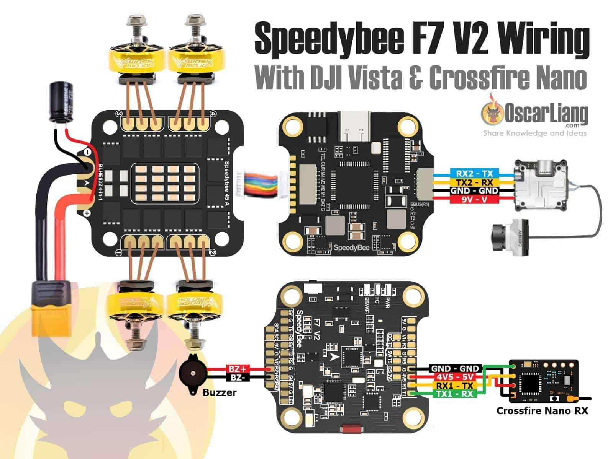
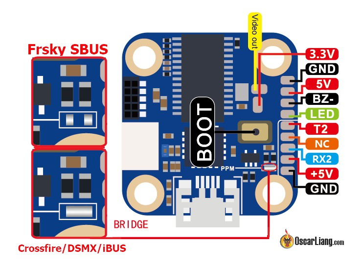

## 1.2ghz 1.3ghz 5.8ghz relay repeater fpv vtx vrx wiring diagram 

## 2019 GT Rabbit R239 R90 2inch micro quad fc pinout wiring diagram 

## 4in1 esc anatomy components fpv racing drone 

## Atas_Mini_PDB_Pro_power_distribution_board_manual 

## BetaFPV 35a aio f4 fc pinout wiring connection pads 

## BetaFPV A02 VTX connection diagram fc 

## CLRacing F7 V2 wiring diagram connection pinout 

## Crius aio wiring MPNG 

## Diatone Mamba DJI F722 MK2 Flight Controller pinout wiring diagram connection scaled 

## Diatone Mamba F411 Nano FC wiring diagram pin out 

## Eachine Nano VTX V2 manual 2 

## Eachine Novice II rtf kit manual 3 fc fpv goggles vtx explain 

## Eachine TX01 25mW VTX Camera manual instruction 

## FX796T 5.8ghz 40 chvideo transmitter vtx mini quad manual 1 

## Flywoo Firefly Hex Nano vtx channels 

## Foxeer F722 Dual Flight Controller fc connection wiring diagram 

## Foxeer TM25 Switcher VTX manual instructions 1 

## GEPRC Naked GoPro 8 Case BEC board pinout button diagram 

## Geelang Kuda 85X Pusher Whoop fc manual rotated 

## HGLRC FD445 Stack FD F4 Mini FC 4in1 ESC wiring pinout diagram 

## HGLRC Zeus Nano vtx manual instructions 

## HGLRC Zeus35 F411 FC manual connection diagram pinout 

## Holybro Atlatl Mini VTX connection pin out wiring channel bands diagram 

## KISS FC V2 flight controller connection diagram 

## Kakute F7 Flight Controller pin out diagram 

## Kombini fc connection diagram esc motor buzzer vtx 

## MAMBA F411 AIO FC whoop toothpick manual connection wiring pinout spec 

## MultiView Duo Camera Switcher wiring connection diagram 

## Nano Cricket 5.8GHz VTX manual instructions 

## Piko BLX FC connection diagram mini quad 

## Racerstar StarF7 6S AIO FC wiring diagram connection analogue fpv 

## Racerstar StarF7 6S AIO FC wiring diagram connection dji air unit 

## Racerstar TattooF4S FC ESC Integrated Flight Controller connection diagram rx motor fpv camera vtx 

## Rekon 3 Nano Long Range FPV Drone manual 

## RushFPV Blade F722 Digital Analog Flight Controller V2 fc wiring diagram 

## RushFPV Blade f722 fc analog digital manual wiring diagram connection 

## Skyzone SKY04X fpv goggles buttons connectors name diagram 

## SpeedyBee F405 V3 FC wiring diagram pinout 

## SpeedyBee F405 WING APP Fixed Wing Flight Controller fc board pinout diagram 

## SpeedyBee F405 WING APP Fixed Wing Flight Controller pdb board pinout diagram 

## SpeedyBee F405 WING APP Fixed Wing Flight Controller wireless board pinout diagram 

## SpeedyBee F405 WING APP Fixed Wing Flight Controller wiring diagram connectors 

## SpeedyBee F405 WING APP Fixed Wing Flight Controller wiring diagram solder 

## SpeedyBee F7 V3 FC pinout wiring diagram connectors 

## SpeedyBee F7 V3 FC pinout wiring diagram solder 

## SpeedyBee TX800 VTX video transmitter wiring diagram flight controller fc uart tx rx 

## Speedybee F4 AIO FC connection diagram wiring pinout 

## Speedybee F7 fc V2 stack 45a esc wiring connection diagram 

## Strix Binary F10 FC Flight Controller HelioRC wiring pinout connection diagram 

## airbot omnibus fireworks v2 fc flight controller connection wiring diagram pinout 

## akk nano2 vtx video transmitter manual instruction 1 

## atas raceband 600mw video transmitter vtx manual 1 

## betafpv 16A 4in1 ESC wiring pinout diagram  

## betafpv F4 1S 12A AIO toothpick fc expresslrs elrs wiring pinout 

## betafpv bec board naked gopro hero 6 7 pin out connection wiring 

## betafpv f4 fc wiring pinout diagram bottom 

## betafpv f4 fc wiring pinout diagram top 

## betafpv nano hd camera connection diagram 

## brainfpv_connection_wiring 

## cl racing f7 flight controller fc connection wiring diagram v1 

## connect R9 mini to flight controller fport wiring 

## connect R9 mini to flight controller sbus wiring 

## connection fpv camera microphone video transmitter vtx audio wiring 

## crazybee f4 pro fc V3.0 pinout wiring diagram 

## darwinfpv darwin129 7 inch fpv drone manual instruction 

## darwinfpv f4 whoop toothpick fc pinout wiring MATEKF411 

## diatone mamba f722 dji mk2 tekko32 f3 different pinout wiring 

## diatone mamba h7 fc flight controller manual instructions wiring 

## diatone sp3 vtx connection diagram 

## diy cheap solder smoke extractor wiring connection diagram 

## dji fpv system air unit wiring diagram connection caddx vista flight controller f4 vbat lipo voltage 

## dji fpv system air unit wiring diagram connection f7 flight controller voltage regulator BEC 

## dvr fpv camera vtx connection osd fc split signal 

## dvr fpv camera vtx connection split signal 

## dvr fpv camera vtx connection video in out 

## dys f4 pro fc connection diagram pin out 

## eachine et600 video transmitter vtx manual 2 

## eachine nano vtx pin out wiring 

## eachine tyro79 fc expresslrs elrs reicever rx connection wiring uart serial 

## emax skyline32OSD flight controller fc F1 pin out diagram 

## esc anatomy components fpv racing drone 

## expresslrs 2.4ghz pp ep1 ep2 elrs receiver rx pinout connection wiring uart 

## fatshark receiver module pinout wiring connection 

## fpv antenna anatomy active element ground plane coaxial cable connector 

## fpv camera vtx connection wiring diagram 

## fpv drone anatomy components parts diagram fc esc motor prop receiver vtx antenna camera 

## frsky r9 receiver rx pin out diagram 

## frsky r9m tx transmitter module pin out diagram 

## fullspeed toothpick vtx setup manual 

## fury f3 fc connection diagram diatone gt 2017 

## gps flight controller fc connection wiring fpv drone betaflight bn220 bn180 

## gps module flight controller fc connection wiring mini quad racing drone bn220 

## gps receiver module ftdi adapter connect wiring serial tx rx 5v gnd program 

## happymodel pp ep1 ep2 2.4ghz expresslrs elrs receiver rx pinout connection wiring 

## hdzero freestyle vtx pinout wiring power uart tx rx smartaudio 

## hdzero vtx fc wiring connection diagram uart tx rx 

## hglrc sector132 bnf fpv drone caddx vista dji crossfire manual instruction 

## hive 16 fc pinout diagram 

## hobbyking video switcher 3 channel pwm wiring diagram 

## holybro kakute f7 aio fc flight controller wiring diagram 

## holybro kakute f7 fc flight controller pinout connection wiring diagram 

## holybro kakute h7 bt fc pin out connection diagrams scaled 

## how to build fpv drone 2023 wiring diagram analog 

## how to build fpv drone 2023 wiring diagram dji digital 

## how to build fpv drone analog mamba f722 mk2 wiring diagram 

## how to build fpv drone tutorial dji vista quad wiring diagram speedybee f7 v2 crossfire nano rx 

## iFlight Succex Nano 16x16mm FC pin out wiring diagram 

## iflight kiss fc flight controller connection diagram wiring esc camera vtx rx 

## kakute f4 fc pin out connection diagram 

## kakute f7 flight controller fc r9mm mini rx receiver wiring connection smartport fport 

## matek f405 ctr fc flight controller manual connection diagram 

## matek f411 wte fc wiring connection diagram dji vista expresslrs rx gps hee wing t1 ranger 

## mini quad brushless motor anatomy bell magnet bearing stator wilding shaft 

## mini quad brushless motor anatomy bell magnet bearing stator winding shaft diagram 

## mini quad frame anatomy name part diagram 

## motor wires led racewire clracing wiring diagram connection esc 

## multiFlite NANO B FC V1.1 pinout diagram bottom 

## multiFlite NANO B FC V1.1 pinout diagram top 

## nano long range 1s 3 inch fpv drone 18650 li ion cell battery wiring diagram 

## omnibus f4 aio fc flight controller connection diagram esc motor fpv camera vtx battery rx 

## quadcopter fpv racing mini quad drone anatomy parts components diagram 

## raceflight lua script taranis change pid vtx settings connection diagram bottom 

## raceflight lua script taranis change pid vtx settings connection diagram top 

## radiance fc flight controller furiousfpv prototype pins diagram 

## radiance fc flight controller furiousfpv prototype wiring diagram 

## runcam split 4 wiring uart tx rx flight controller fc connection 

## runcam tx100 nano vtx connection diagram 

## runcam tx200u vtx channel lock unlock 

## rush tank race II 2 vtx video transmitter manual instructions 

## rushfpv Extreme 60A 4in1 ESC manual wiring specs 

## s800 fpv wing wiring diagram connection 

## spracing f3 EVO FC WIRING connection 

## tbs crossfire nano rx betaflight fc connection pinout wiring 

## tvs diode esc power connection wiring anode cathode positive negative 

## vtx control taranis lua script smartaudio tramp telemetry connection wiring 

## walksnail avatar digital hd fpv system air unit vtx flight controller fc wiring connection uart tx rx diagram 

## walksnail avatar hd v2 vtx fc usb wire connection pinout diagram 

## ws2812 rgb led fc flight controller connection wiring signal 5v gnd 

## zmr250 pdb connection diagram minimosd 

## zmr250 pdb connection diagram no osd 

## zmr250 pdb connection diagram simple osd voltaged 

## zmr250 pdb voltage regulator connection diagram step down 

